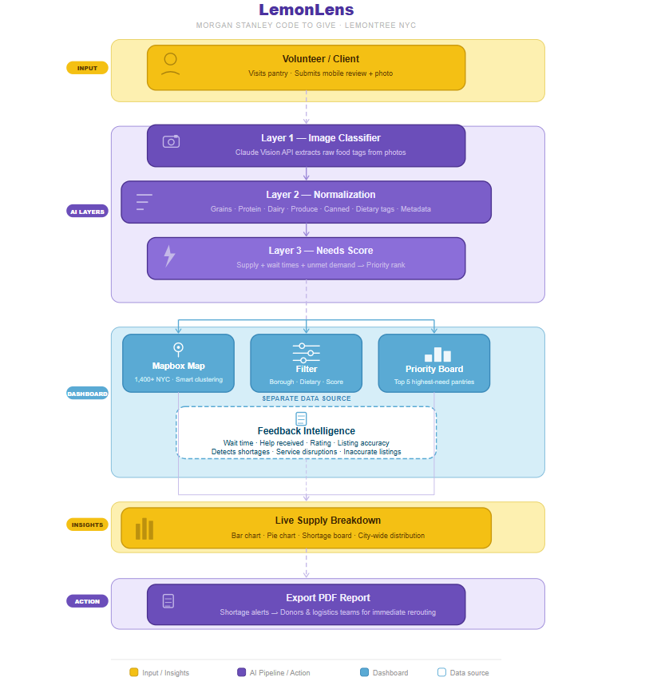
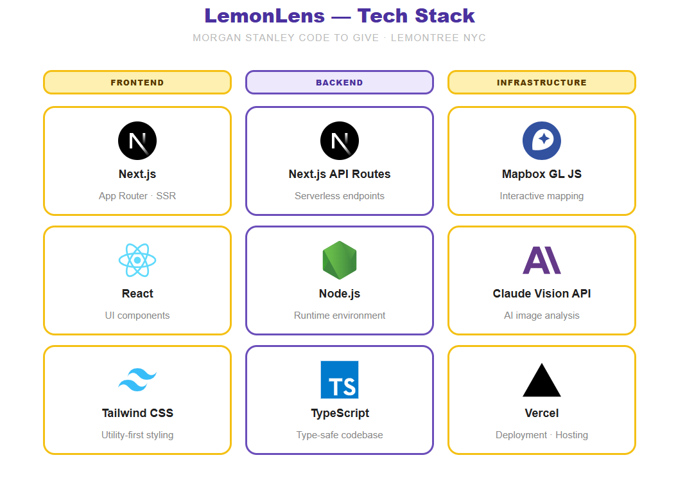

# LemonLens

LemonLens is an operational intelligence platform built for **Lemontree** as part of the **Morgan Stanley Code to Give Hackathon**. It transforms pantry resource data, food photos, and structured user feedback into actionable insights by combining AI-based food detection, normalized supply profiling, and operational issue tracking to help partners identify and address food access gaps across NYC.

---

## System Architecture

LemonLens follows a multi-layer data processing pipeline designed for high scalability and real-time insights.

### LemonLens Operational Flow

#### **1. Client Data Input**
* **Action**: A client or volunteer visits a pantry and submits a mobile review.
* **Data Captured**: They record the wait time in minutes, confirm if they received help, and upload a photo of the food provided.

#### **2. AI Image Processing (Layer 1)**
* **System**: The raw photo is sent to the **Claude Vision API** for instant analysis.
* **Result**: The AI extracts structured tags such as "fresh produce," "protein," or "dairy," replacing hours of manual photo review.

#### **3. Operational Logistics (Layer 2 & 3)**
* **Normalization**: Raw tags are grouped into standardized supply profiles including Grains, Protein, Dairy, Produce, and Canned goods. This layer converts noisy detections into analytics-ready profiles that can support filtering, aggregation, and dashboard insights.
* **Scoring**: The system merges this supply data with wait times and unmet demand signals to calculate a real-time **Needs Score**.

#### **4. Partner Dashboard Interaction**
* **Map Exploration**: Partners log in to view 1,400+ NYC locations clustered on a **Mapbox** map.
* **Filtering**: Users filter by borough or dietary needs (e.g., "Protein in Brooklyn") to see which pantries have the highest priority scores.

#### **5. Reporting & Action**
* **Insights Bar**: The dashboard calculates a live supply breakdown for the current neighborhood view.
* **Decision Making**: Partners export a PDF operational report to share shortage alerts with donors and logistics teams for immediate supply rerouting.

---

## Key Features

- **AI-Based Inventory Tracking**: Automatically detects food items from pantry photos to verify current stock levels.
- **Operational Priority Board**: A real-time leaderboard ranking the Top 5 pantries with the highest demand pressure and supply shortages.
- **Interactive Resource Map**: A Mapbox-powered visualization of 1,400+ NYC food locations with smart clustering and viewport-based insights.
- **Live Supply Breakdown**: Dynamic charts showing the city-wide distribution of key food groups based on current map filters.
- **Feedback Intelligence System**: A structured feedback workflow captures whether users received help, wait times, listing accuracy, ratings, written comments, and standardized “did not receive help” reasons to help detect recurring operational issues like shortages, service disruptions, and inaccurate listings.

---

---

## Setup and Installation

1. **Clone the repository**
   git clone [https://github.com/your-repo/lemonlens.git](https://github.com/your-repo/lemonlens.git)
   cd lemonlens
   
2. **Install dependencies**
   npm install
   
4. **Configure Environment Variables**
   Create a .env.local file in the root directory:
   - ANTHROPIC_API_KEY=your_api_key
   - NEXT_PUBLIC_MAPBOX_ACCESS_TOKEN=your_mapbox_token
     
5. **Run the development server**
   npm run dev

**Team Members**:
- Ishrat Arshad
- Rohit Karnik
- Anish Yenduri
- Nirmit Bhoyar
- Philip Shaji Baby

**Acknowledgments**

We would like to thank **Morgan Stanley** for hosting the **Code to Give Hackathon** and providing this platform for social impact. We also express our sincere gratitude to our mentor, **Nirali Maniar**, for her invaluable guidance, support, and technical feedback throughout this project!

## License
This project is open source and available under the **MIT License**.
