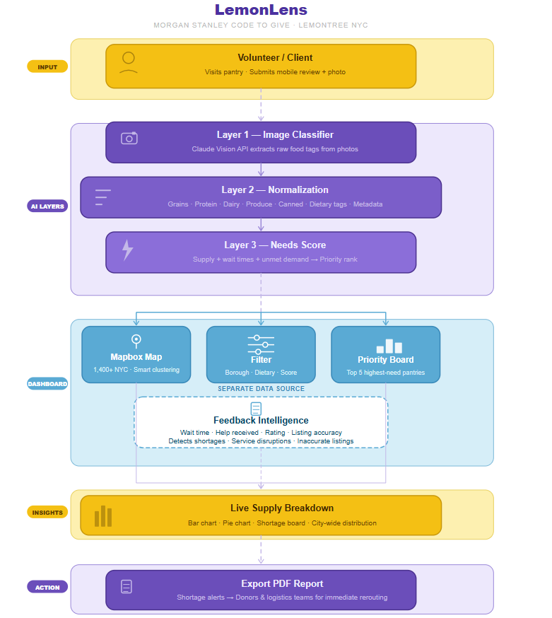

# LemonLens

LemonLens is an operational analytics platform built for the Lemontree nonprofit as part of the Morgan Stanley Code to Give Hackathon.

The system transforms community feedback, pantry reviews, and food inventory photos into structured operational insights that help food banks, donors, and partners make faster and more informed decisions about where food resources are needed most.

Instead of manually reviewing scattered feedback and images, LemonLens automatically categorizes food supply data, analyzes service signals such as wait times and unmet demand, and surfaces priority insights through an interactive dashboard.

---

# Problem

Lemontree collects valuable community feedback about food access across New York City, including pantry reviews, wait times, and photos of available food resources.

However, this information is difficult for partners to organize, interpret, and act on in real time.

Current challenges include:

- Pantry feedback and photos are unstructured and require manual review
- Operational issues such as shortages or long wait times are difficult to detect quickly
- Data is difficult to aggregate across neighborhoods or food categories
- Partners lack a simple way to identify which pantries require urgent support

As a result, food banks and donors often rely on incomplete or delayed information when deciding where to send resources.

---

# Solution

LemonLens converts community feedback into real-time operational intelligence.

The system automatically processes pantry photos, categorizes food inventory, analyzes demand signals, and visualizes trends through an interactive dashboard.

This allows partners to quickly identify shortages, service disruptions, and high-demand locations across the city.

Instead of manually interpreting reviews and images, partners can immediately see:

- Which pantries are under the most pressure
- What types of food are currently missing
- Where operational issues are emerging
- Where the next shipment of resources should be sent

---

### LemonLens Operational Flow

## 1. Client Data Input

Clients or volunteers visit a pantry and submit a mobile review.

Data captured includes:

- Wait time in minutes
- Whether assistance was received
- A photo of the available food
- Optional written feedback

This creates a real-time signal about pantry operations and available resources.

---

## 2. AI Image Processing

Pantry photos are analyzed using the Claude Vision API.

The system extracts structured food tags such as:

- Produce
- Protein
- Dairy
- Grains
- Canned goods

This replaces hours of manual photo review and converts visual data into structured inventory signals.

---

## 3. Data Normalization

Extracted food tags are standardized into supply profiles.

Raw detections are grouped into consistent food categories that support filtering, aggregation, and analytics across locations.

---

## 4. Needs Scoring

LemonLens generates a real-time Needs Score for each pantry.

This score combines:

- Detected food supply
- Wait time signals
- Reports of unmet demand
- Operational feedback from users

The result is a priority ranking that highlights which locations require immediate support.

---

## 5. Partner Dashboard

Partners interact with the data through a web dashboard that provides:

   ### Map Exploration
   
   A Mapbox-powered visualization of more than 1,400 food resource locations across New York City.
   
   Locations are clustered dynamically and update based on viewport and filters.
   
   ### Filtering and Search
   
   Users can filter resources by:
   
   - Borough
   - Food category
   - Service type
   - Operational priority
   
   This enables targeted exploration of supply gaps and service demand.
   
   ### Priority Board
   
   A live ranking of the highest-need pantries based on the Needs Score.
   
   This allows organizations to quickly identify where food shipments or operational support should be directed.
   
   ### Reporting and Insights
   
   The platform generates operational summaries including:
   
   - City-wide food supply breakdowns
   - Category shortages
   - Demand hotspots
   - Service disruptions
   
   Partners can export shareable PDF reports to coordinate with donors, logistics teams, and community organizations.
   
   ---

# Key Features

## 1.) AI-Based Inventory Detection

Automatically detects food categories from pantry photos using computer vision.

## 2.) Operational Priority Board

Ranks pantries by urgency using real-time operational signals.

## 3.) Interactive Resource Map

Mapbox-powered visualization of 1,400+ NYC food locations with clustering and viewport filtering.

## 4.) Live Supply Analytics

Dynamic charts showing distribution of food categories across the city.

## 5.) Feedback Intelligence System

Aggregates user feedback including wait times, service success, listing accuracy, and unmet demand signals to identify recurring operational issues.

---

# Impact

LemonLens helps partners answer a critical operational question:

**Where should the next shipment of food go right now?**

By transforming raw community feedback into structured analytics, the platform enables faster and more informed decisions about food distribution and resource allocation.

This helps improve service reliability, reduce shortages, and strengthen food access across communities.

---
# Future Improvements

Potential extensions of the platform include:

- Integration with public datasets such as demographic and health indicators
- Predictive models for food demand forecasting
- Automated alerting for emerging shortages
- Expanded analytics for nonprofit partners and city agencies

---

## Setup and Installation

1. **Clone the repository**
   git clone [https://github.com/your-repo/lemonlens.git](https://github.com/your-repo/lemonlens.git)
   cd lemonlens
   
2. **Install dependencies**
   npm install
   
4. **Configure Environment Variables**
   Create a .env.local file in the root directory:
   - ANTHROPIC_API_KEY=your_api_key
   - NEXT_PUBLIC_MAPBOX_ACCESS_TOKEN=your_mapbox_token
     
5. **Run the development server**
   npm run dev
   

# Hackathon Context

LemonLens was developed during the Morgan Stanley Code to Give Hackathon for Lemontree NYC.

The project demonstrates how data processing and visualization can transform community feedback into actionable insights that strengthen food access operations.

**Team Members**:
- Ishrat Arshad
- Rohit Karnik
- Anish Yenduri
- Nirmit Bhoyar
- Philip Shaji Baby

**Acknowledgments**

We would like to thank **Morgan Stanley** for hosting the **Code to Give Hackathon** and providing this platform for social impact. We also express our sincere gratitude to our mentor, **Nirali Maniar**, for her invaluable guidance, support, and technical feedback throughout this project!

## License
This project is open source and available under the **MIT License**.
